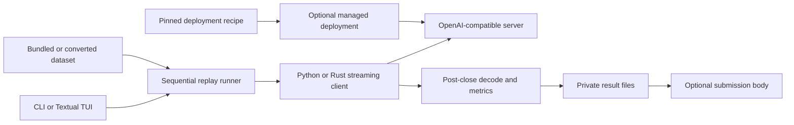

# Architecture

`agentperf-local` replays recorded agent conversations against one
OpenAI-compatible endpoint. Its core is a sequential benchmark client. The
managed path downloads a pinned catalog model and supervises a server process
for the length of one replay.

## Current system

The attached-endpoint path:

1. Select a bundled dataset or load a converted manifest.
2. Configure an endpoint and model name.
3. Replay every task and turn once, in source order, at concurrency one.
4. Decode each closed response and calculate timing, token, fidelity, and tool
   metrics.
5. Commit five private result files, with `summary.json` written last.

The managed path detects CUDA, ROCm, or Apple Metal. It matches the host
against the recipe's accelerators, frameworks, installed runtimes, and memory
floor. It then downloads and verifies the pinned files, starts an owned
localhost server, checks its model alias and GPU startup evidence, writes a
pre-run binding, runs the same runner, and stops the owned process group.

The CLI and the TUI share one managed pipeline and one runner. The TUI keeps no
second benchmark implementation. See [TEXTUAL_TUI.md](TEXTUAL_TUI.md).

## Package layout

The `agentperf_local` package groups modules by the stage of a run they serve.
Each package imports only from packages above it in this table.

| Package | Contents |
| --- | --- |
| `common` | JSON values and typed readers, durable file writes, digests and identifiers, unit conversions, the percentile convention, and package data paths. |
| `workload` | The manifest and trace schema, the bundled replays, and recording conversion. |
| `client` | The Python and Rust raw streaming clients, the choice between them, and the endpoint and request contracts. |
| `metrics` | Post-close stream decoding, response reconstruction, tokenization, and request metrics. |
| `tools` | Shell-command parsing and live Docker tool replay. |
| `provenance` | Hardware probes and facts, the hardware snapshot, the served-context rule, source provenance, and the measurement binding. |
| `replay` | The run configuration, cache isolation, the sequential runner, and post-close fidelity checks. |
| `reports` | Private result files and the plain-terminal progress renderer. |
| `telemetry` | The NVIDIA collector, the replay-scoped power collector, and post-phase reduction. |
| `deployment` | The model catalog, context policy, framework selection, the pinned-file cache, endpoint probes, runtime qualification, the owned server, and the managed-run pipeline. |
| `submission` | The typed body, the pinned spec check, the framework-commit lookup, and the upload client. |
| `tui` | The Textual app, its stylesheet, inputs, messages, labels, widgets, branding, and the replay controller contract. |
| `cli` | The argument readers, the parser definitions, and one module per group of commands. |

A package `__init__` exports nothing. Every name is imported from the module
that defines it. Bundled data lives under `data/`, and `common.package_paths`
is the one place that locates it. The recipes live in `recipes/` at the
repository root; a wheel carries a copy under `data/recipes/`.

## Measurement invariants

- **The stream loop does no Python work.** The clients collect raw response
  bytes and timestamps while the connection is open. Parsing, tokenization,
  aggregation, progress updates, and file writes happen after the response
  closes.
- **Both clients behave the same.** Python is the default. Rust is an optional
  client that takes timestamps off the Python event loop. Both use transport
  policy `direct-sse-no-retry-v1`: HTTP/1.1, compact `orjson` request bytes, no
  ambient proxy, no redirect, no retry, and 2xx-only success. Equivalence tests
  pin them to identical metrics.
- **One pass, in order.** Tasks and turns run once in source order at
  concurrency one. Each request carries the full prior conversation.
- **Full context at batch 1.** A full run serves 65,536 tokens with one active
  sequence. Anything less is reduced and not comparable. More is still full.
- **Exact output lengths.** The default `exact` policy sends `ignore_eos` so
  every turn generates its recorded token count. A server that drops it cannot
  run `exact`. The CLI `run` refuses such a server and names
  `--output-token-policy recorded`. The one exception is Ollama with no policy
  given: `run` switches to `recorded` and warns. The TUI switches to `recorded`
  for any server that drops it. A `recorded` result is not directly comparable.
- **Transport check.** Each response passes an F0 check: the stream decoded
  cleanly, tool calls are well formed, and the finish reason fits the response.
  This checks shape, not task correctness.

## Datasets

`agentperf-default-v1` is the default replay. It holds eight converted agent
tasks with 168 model turns and 172 recorded tool actions. It stores separate
SWE-bench manifests for `arm64` and `x86_64` so live tools use native images.
PinchBench fixtures are copied into the run's private workspace before each
task, so the bundled files never change.

`aa-mini-v1` is a quick install check. It is one synthetic library-assistant
task with six model turns and five tool actions, sized for an 8,192-token
context. Each turn has an authored 256-token target. Its results are not
comparable.

Custom datasets use the manifest and JSONL trace format in
[FORMATS.md](FORMATS.md). Agent recordings are conversion inputs only.

## Models and recipes

[`recipes/`](../recipes) holds one YAML file per recipe. A recipe has one of three shapes:

- A **GGUF recipe** pins one or more files by size and SHA-256. llama.cpp serves
  it on CUDA, ROCm, or Metal.
- A **weights recipe** pins every file of a Hugging Face revision that the
  runtime opens. SGLang or vLLM serves it on CUDA.
- A **Splash package recipe** pins every file of a packed Splash package: its
  manifest and its target, draft, and tokenizer folders. Splash serves it on
  Apple Silicon Metal, from the verified snapshot rather than its own download.

A weights or Splash recipe names the exact runtime release it was checked against, and
the launcher refuses any other. A server can load the right weights, report
the right context and backend, and still generate nonsense. Readiness checks do
not read generated text, so they cannot catch that.

Before launch, the launcher checks that the executable exists and that memory
meets the recipe's floor. The floor uses the accelerator's own memory, or total
host memory on unified-memory devices. Host memory is a ceiling, not free
space. On a unified device the floor is necessary but not sufficient. The GPU
backend is verified from startup evidence after launch.

Each recipe stores its attention shape and measured fixed reserves, not one
opaque number. The floor is computed from that shape for any context. A weights recipe also pins
sizes the runtime would otherwise choose from free memory, such as the SGLang
token pool. It can pin the fused-expert kernel too, so the served configuration
is the same on every card.

### Context classification

`managed-run --context-tokens N` serves a smaller context. The memory floor is
computed from the recipe's memory shape at that context. Readiness still requires the server to report exactly the requested
context.

A reduced run stays distinct. The served context joins the benchmark identity
and the pre-run binding. `summary.json` records the requested and observed
tokens in `config.context` with `reduced: true`. The submission sends the
requested and served context, so the service can separate full and reduced
contexts. A run whose server served less than it asked for cannot be submitted.

For an attached endpoint, the run reads `meta.n_ctx` from the server at start.
An endpoint that does not report its context is recorded as unobserved, with
the reason.

### Scripts

The scripts under `scripts/` are development tools. Run each with
`uv run scripts/<name>.py --help`:

- `estimate_kv_budget.py` estimates KV-cache bounds from a model config. The
  managed memory formula mirrors it.
- `build_model_manifest.py` builds the pinned per-file manifest for one recipe
  from a Hugging Face revision.
- `render_textual_screens.py` renders TUI screens as SVG files.

`build-default-containers.sh` and `install-swebench-validation.sh` prepare the
Docker images for live tool mode.

## Replay controls

Output length uses one of three policies: `exact` (default), `recorded`, or
`fixed`. The standard sampling preset uses `temperature=0.7`, `top_p=0.8`,
`top_k=20`, and `min_p=0.0`. Custom sampling sends only explicit values.

Cache isolation is on by default. One namespace is reused within a run and
changes between runs unless you set it. This keeps prefix reuse within a run
and prevents reuse between runs.

Tool replay has three modes:

| Mode | Behavior |
| --- | --- |
| `none` | Default. Skip tool time and run no commands. |
| `recorded` | Sleep for the recorded tool durations. |
| `live` | Run the recorded shell commands in a Docker container. |

Live mode is opt-in. It uses no container network unless the manifest asks for
one, and `--live-network none` forces none. Commands and cleanup have bounded
timeouts, and only the selected workspace is mounted. Recorded commands are
untrusted input. Docker reduces the risk but is not a security boundary.

## Supporting components

| Component | Behavior |
| --- | --- |
| Hardware doctor | Reports local facts without hostnames, serials, UUIDs, PCI addresses, or raw command output. Reads NVIDIA GPUs from `nvidia-smi`, AMD GPUs from `amd-smi` or `rocm-smi`, Intel GPUs on Linux from `clinfo` with Intel's compute runtime, and Mac GPUs from `system_profiler`. Exits nonzero unless exactly one accelerator is found. |
| Benchmark binding | Hashes the workload before a run and binds it to the suite, model, runtime, and hardware fields. |
| Runtime qualification | Runs five synthetic endpoint probes after the server is ready and before the replay, for managed and attached runs alike. It records structure only, not generated text or URLs. Passing is necessary, not sufficient. |
| NVIDIA telemetry | A child-process collector that runs around the replay on NVIDIA hosts. A submission carries the measured phase's power summary. |
| Submission body | Builds one typed body from the recorded files and checks it against the service's pinned spec. See [SUBMITTING.md](SUBMITTING.md). |

Machine-readable contracts for these files live under [`docs/schemas`](schemas).

## Evidence boundary

Three claims stay separate:

- **Configuration intent:** local bindings show which files, labels, endpoint
  scope, and client the user selected.
- **Measured execution:** result files show what the local client observed on
  the request path.
- **Verified identity:** proving the physical GPU, model bytes, runtime bytes,
  and process placement needs an external trust mechanism. None exists here.

Anyone can modify this open-source client and fabricate consistent evidence.
Every submission is therefore self-reported.

For an attached endpoint, the hardware snapshot describes the client machine,
not the model server. Its model digest names the endpoint alias. It does not
attest to the remote model bytes.

A failed probe describes the endpoint, which is not always the model behind
it. A tool-call parser can drop calls that the raw text contains. The probe
reports what an OpenAI-compatible client receives. The parallel-call probe is
advisory: the report records it, but only the other four probes decide whether
qualification passed. The reports under
[`docs/evidence`](evidence) show both outcomes: an MLX gpt-oss-20b endpoint
passed two of five probes, and Gemma 4 26B-A4B on its managed recipe passed
all five.

The private result directory can contain prompts, command names, errors,
endpoint metadata, and paths. The public aggregate uses typed allowlists, but
labels and detailed timing can still fingerprint a run.

## Crash and file safety

Result paths must be new. Writers reject symlinked output locations and never
replace committed files. Data files are created with private permissions and
synced, then `summary.json` is written as the completion marker. A summary is
not a signature. Validators reopen and cross-check the full set.

A crash can leave an incomplete attempt directory. It is never resumed into a
scored run. The next attempt starts from a clean boundary.

## Not implemented

- a scored accuracy suite;
- bundled runtime binaries or a general model installer;
- signed catalogs (the bundled catalog is anchored on the release commit);
- power measurement without `nvidia-smi`;
- independent GPU, model, or process attestation; and
- the service-side classifier and the verified tier.
